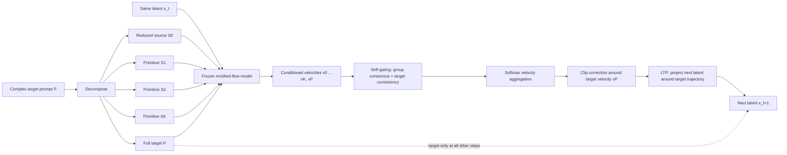

# How SPFC Works

**Sparse Primitive Flow Composition (SPFC)** is a training-free inference method for making a rectified-flow text-to-image model follow compositionally difficult prompts more faithfully.

Its central idea is:

> Break a hard prompt into simpler semantic views, ask the same frozen model how each view would move the **same current latent**, combine only the mutually compatible directions, and keep the result inside a trust region around the full target prompt's trajectory.

SPFC is trying to improve attribute binding, object count, spatial relations, reflections, shadows, and other concepts that a model may drop or entangle when they all appear in one long prompt. It does this without training, fine-tuning, image feedback, CLIP/VQA scoring, or an external judge.

## The mechanism at a glance



The important distinction is that SPFC does **not** blend prompt text, text embeddings, separately generated images, or independently sampled trajectories. Every candidate velocity is evaluated from the same latent state `x_t` and timestep `t`, so the directions live in the same local velocity space and can be compared directly.

## 1. Turn one difficult prompt into semantic views

For a target such as:

> A marble fox wearing green rain boots in front of a cracked mirror, with a dragon-shaped shadow on the wall.

SPFC constructs:

- a **source prompt**, containing the stable scene backbone;
- several **primitive prompts**, each making one difficult requirement explicit, such as the green boots, cracked reflection, or dragon-shaped shadow;
- the original **target prompt**, which remains the authoritative description.

The condition set is

$$
\mathcal{C} = [S_0, S_1, \ldots, S_K, P].
$$

Each entry is a complete natural-language prompt, not an isolated token. The source preserves a coherent base scene; the primitives expose individual semantics that may be weak inside the full prompt; and the target preserves the intended composition as a whole.

## 2. Intervene only at selected denoising steps

A rectified-flow model predicts a velocity

$$
v_\theta(x_t,t,c)
$$

that tells the sampler how to move the current latent `x_t` under text condition `c`.

At an ordinary step, SPFC behaves exactly like target-prompt generation:

$$
v_P = v_\theta(x_t,t,P),
\qquad
x_{t+1}=\operatorname{Step}(x_t,v_P,t).
$$

At a selected aggregation step, it evaluates every condition from the same `x_t`:

$$
v_i = v_\theta(x_t,t,c_i),
\qquad c_i \in \mathcal{C}.
$$

This sparsity matters for two reasons. It reduces the extra model evaluations, and it prevents the simpler prompts from taking over the whole generation. In the repository's 24-step benchmark configuration, aggregation is scheduled at 16 selected steps; the exact schedule is configurable.

## 3. Let the model judge its own directions

SPFC uses the geometry of the predicted velocities as its feedback signal.

First it computes pairwise cosine similarity:

$$
M_{ij}=\cos(v_i,v_j)
=\frac{\langle v_i,v_j\rangle}{\lVert v_i\rVert\lVert v_j\rVert}.
$$

Each condition then receives two gates.

### Consensus gate

The consensus gate measures whether a direction agrees with the other semantic views:

$$
g_i^{\mathrm{cons}}
=\operatorname{clamp}\left(
\frac{1}{N-1}\sum_{j\ne i}\max(0,M_{ij}),
g_{\min},g_{\max}
\right).
$$

A primitive that points against most of the scene receives less influence. Agreement does not prove that a primitive is correct, but disagreement is a useful warning that it may disrupt the shared composition.

### Target-consistency gate

The second gate asks whether the condition agrees specifically with the complete target prompt:

$$
g_i^{\mathrm{tgt}}
=\operatorname{clamp}\left(
\max(0,\cos(v_i,v_P)),
g_{\min},g_{\max}
\right).
$$

This prevents group consensus among simpler prompts from overruling the actual request. The target is therefore both a participant in the composition and its semantic reference.

## 4. Compose the compatible velocities

The two gates modulate a user-provided base weight `w_i`:

$$
r_i=w_i\,g_i^{\mathrm{cons}}\,g_i^{\mathrm{tgt}}.
$$

The scores become normalized weights through a temperature-scaled softmax:

$$
\alpha_i
=\frac{\exp(r_i/\tau)}{\sum_j\exp(r_j/\tau)},
\qquad
\sum_i\alpha_i=1.
$$

SPFC then forms the raw composed velocity:

$$
v_{\mathrm{raw}}=\sum_i\alpha_i v_i.
$$

The weights are recomputed at every aggregation step. SPFC can therefore favor different primitives as the latent evolves rather than committing to one fixed prompt mixture for the entire sample.

## 5. Express steering as a bounded correction to the target

The raw mixture is not applied directly. SPFC treats it as a proposed correction to the full target velocity:

$$
\delta=v_{\mathrm{raw}}-v_P.
$$

It clips the correction to a fraction `rho` of the target velocity norm:

$$
\delta_{\mathrm{clip}}
=\operatorname{clip\_norm}
\left(\delta,\rho\lVert v_P\rVert\right),
$$

and applies the configured steering strength `lambda`:

$$
v_{\mathrm{SPFC}}=v_P+\lambda\delta_{\mathrm{clip}}.
$$

This target-relative form is essential: primitives contribute a bounded nudge, not a replacement trajectory. With `lambda = 0`, the method reduces to the target velocity at every step.

## 6. Project the actual latent update back toward the target path

Velocity clipping limits the proposed direction, but scheduler dynamics determine the actual next latent. **Latent Trajectory Projection (LTP)** adds a second constraint in the space the sampler truly updates.

SPFC computes both possible next states:

$$
x_{t+1}^{P}=\operatorname{Step}(x_t,v_P,t),
$$

$$
x_{t+1}^{\mathrm{cand}}=\operatorname{Step}(x_t,v_{\mathrm{SPFC}},t).
$$

It measures the candidate's deviation from the target path,

$$
\Delta=x_{t+1}^{\mathrm{cand}}-x_{t+1}^{P},
$$

and projects that deviation into a trust ball whose radius is proportional to the size of the target step:

$$
\Delta_{\mathrm{proj}}
=\operatorname{clip\_norm}\left(
\Delta,
r\lVert x_{t+1}^{P}-x_t\rVert
\right),
$$

$$
x_{t+1}=x_{t+1}^{P}+\Delta_{\mathrm{proj}}.
$$

If the scheduler cannot safely be evaluated twice, the implementation falls back to an equivalent trust-region constraint in velocity space.

## What is novel about SPFC?

The novelty is the combination of four ideas into one target-preserving inference mechanism:

1. **Primitive-conditioned flow composition.** A complex request is exposed as several simpler, complete semantic views, and their local rectified-flow velocities are composed from the same latent state.
2. **Model-internal, state-dependent arbitration.** The frozen generator's own velocity geometry supplies consensus and target-consistency signals. No separately trained scorer decides which primitive to trust.
3. **Sparse target-primary steering.** The full prompt owns the normal trajectory; multi-condition composition happens only at scheduled steps where it can alter composition without continuously diluting the target.
4. **Two target-referenced safety bounds.** The velocity correction is norm-clipped, then the scheduler-produced latent is projected around the target path by LTP.

The distinctive mechanism is therefore not prompt decomposition by itself. It is the **self-gated composition of co-located conditional velocity fields, followed by target-centered trust-region projection**.

### How this differs from nearby ideas

| Method | What is combined | Control signal | What anchors the sample |
|---|---|---|---|
| Standard generation | One target-conditioned velocity | Full prompt only | Target trajectory |
| CFG | Conditional and unconditional predictions for one prompt | Fixed guidance scale | CFG-guided target direction |
| Prompt/embedding mixing | Text representations before the model prediction | Usually fixed blend weights | Mixed conditioning |
| SPFC | Several complete prompt-conditioned velocities evaluated at the same latent | Per-step consensus and target agreement | Clipped and LTP-projected target trajectory |

SPFC therefore works one level later than prompt mixing: it composes the model's proposed **motions through latent space**, after each condition has been interpreted in the context of the current partially generated image.

## What SPFC is trying to achieve

SPFC optimizes a practical balance:

$$
\text{better primitive coverage and binding}
\quad\textbf{without}\quad
\text{losing target coherence or destabilizing sampling}.
$$

It is designed to recover concepts the full prompt under-expresses while preserving the full prompt's scene, style, and overall intent. It is not guaranteed to insert every primitive: a concept the base model cannot represent, a poor decomposition, or mutually incompatible primitives can still fail.

## Compact pseudocode

```text
x = seeded noise

for each denoising step t:
    v_target = model(x, t, target)

    if t is not an SPFC aggregation step:
        x = scheduler.step(v_target, t, x)
        continue

    velocities = [model(x, t, condition) for condition in conditions]
    consensus = pairwise_positive_cosine_agreement(velocities)
    target_fit = positive_cosine_to_target(velocities, v_target)
    scores = base_weights * consensus * target_fit
    weights = softmax(scores / temperature)

    v_raw = weighted_sum(weights, velocities)
    correction = clip_norm(v_raw - v_target, rho * norm(v_target))
    v_candidate = v_target + steering_strength * correction

    x_target = scheduler.step(v_target, t, x)
    x_candidate = scheduler.step(v_candidate, t, x)
    offset = clip_norm(x_candidate - x_target,
                       ltp_radius * norm(x_target - x))
    x = x_target + offset

image = VAE.decode(x)
```

## Cost and boundaries

- If there are `N` conditions and `A` aggregation steps out of `T`, SPFC uses roughly `T + A(N - 1)` conditional velocity evaluations instead of `T`.
- It adds no learned parameters and does not modify model weights.
- It operates during sampling, before VAE decoding; there is no image-space feedback loop.
- Its main dependencies are a useful prompt decomposition, a base model with the relevant visual knowledge, and an aggregation schedule early enough to affect structure.

Implementation entry points: [`aggregate_primitive_vfa`](src/aim_flow/aggregation.py), [`generate_sparse_primitive_flow`](src/aim_flow/sampler.py), and the primitive LTP functions in [`ltp.py`](src/aim_flow/ltp.py).
